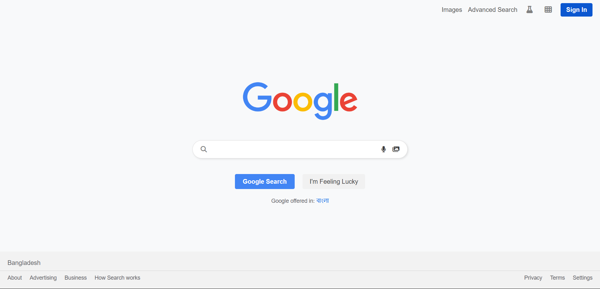
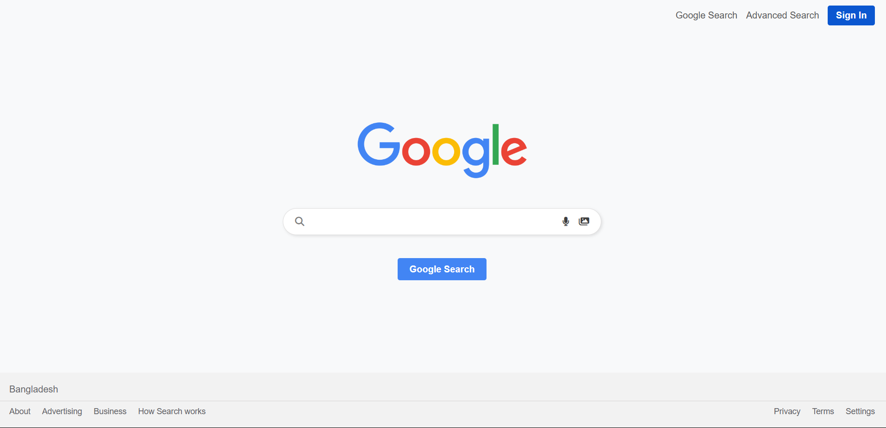
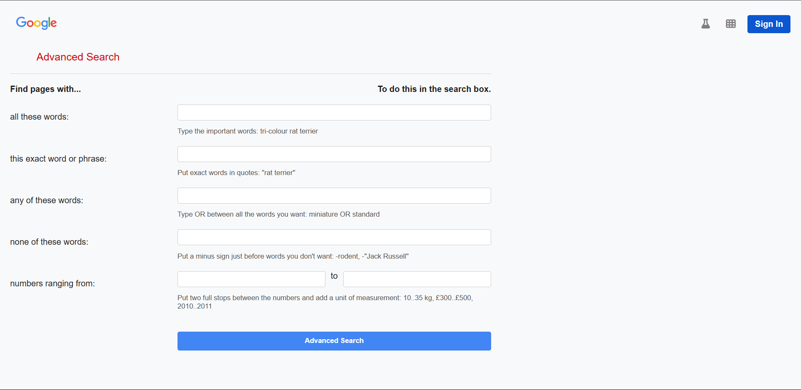
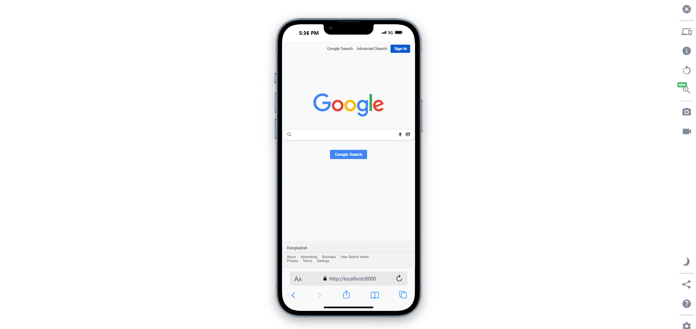

# 🔍 Search: Google Frontend Clone. 
Implement a basic search feature for a front-end web page using HTML, CSS, and JavaScript. The goal is to allow users to enter a search query and be redirected to a relevant search engine results page.


---

## 📌 Overview

**Search** is a front-end project built as part of Harvard's CS50W course. The goal was to replicate core features of Google Search, including:
- Regular Google Search
- Google Image Search
- Google Advanced Search

This project demonstrates proficiency in HTML and CSS responsive UI that mimics Google’s aesthetics and behavior.

---


## 💻 Technologies Used

| **Category**     | **Technologies**                                     |
|-------------------|-----------------------------------------------------|
| **Frontend**     | HTML, CSS                    |

---

## 🌐 Live Demo
📺 [Watch Demo on YouTube](https://www.google.com)

---

## 📸 Screenshots

| Device  | Screenshot                                                                                   |
|---------|---------------------------------------------------------------------------------------------|
| Google Search  |                          |
| Image Search |                                |
| Advanced Search |                                |
| Mobile View |                                |

---

## Features
- 🔎 **Google Search:** Search query redirects to actual .
- 🖼️ **Image Search:** Search for images and get redirected to Google Image results.
- 📤 **Export Options**: Download your resume as a PDF or share it online.
- 🧠 **Advanced Search:** Input multiple conditions and view tailored results via Google's advanced search engine.
- 🎯 **I'm Feeling Lucky:** One-click direct access to the first result of the query.
- 📱 **Responsive Layout:** Clean and consistent layout for both desktop and mobile views.
- 🎨 **Google-inspired CSS:** Recreates Google’s minimalist UI with rounded input boxes and styled buttons.


--- 

##  🗂️ Project Structure

```base 
resume-genie/ 
├── 📁 index.html # Google Search clone
├── 📁 heml 
       ──> image.html      # Google Image Search page
       ──> advanced.html   # Google Advanced Search page
├── 📁 assets/ # image 
├── 📁 css/
          ──> style.html   # Styling for all pages
└── 📄 README.md # Project documentation
```

## 👤 Contact
For any questions or feedback, feel free to reach out:


- Email : giasuddinvuiya2022@gmail.com
- gitHub : [Gias-uddin-vuiya](https://github.com/Gias-uddin-vuiya)

--- 


## 🙏 Acknowledgments
Special thanks to:

- **CS50 Web Programming with Python and JavaScript** for providing the motivation and structure for this project.

- **David J. Malan** and the CS50 team for inspiring thousands of students with world-class content.

- **Google** for UI inspiration.
--- 
## 📜✨ License 
This project is licensed under the [MIT License](/search/LICENSE)
